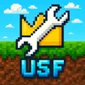

# Unknown Server Framework

> [!IMPORTANT]
> This README was translated with AI assistance. Some wording may be inaccurate. USF does not officially provide English support yet.
>
> You may modify and redistribute USF as long as you comply with the GPL license.

  

  <strong>A survival utility and server management framework based on Minecraft Bedrock Edition ScriptAPI.</strong>

  <a href="../README.md">中文说明</a>
  ·
  <a href="README_tw.md">繁體中文</a>

---

## Overview

Unknown Server Framework（USF）is designed for Minecraft BE official servers（BDS）, personal worlds, LLSE, and Realms. It provides survival utilities and server management features.

> The repository version may lag behind or be newer than the official release. All plugin versions are available in the YYTZ666/usfdown repository.

| Item           | Information                              |
| -------------- | ---------------------------------------- |
| Latest version | **USF0.7.21F**                           |
| Author         | EarthDLL（USFrameTeam）                  |
| Maintainer     | USFrameTeam                              |
| Contributors   | XiaoXiaoYang, Antonbin, 小洋澈, Ice_rink |
| Special thanks | All group members                        |

## Official Resources

| Type                    | Link                                                                           |
| ----------------------- | ------------------------------------------------------------------------------ |
| All versions            | [YYTZ666/usfdown](https://github.com/YYTZ666/usfdown/tree/main/files/main)     |
| MineBBS                 | [minebbs.com/threads/usf.17109](https://www.minebbs.com/threads/usf.17109/)    |
| KLPBBS                  | [klpbbs.com/thread-131213-1-1.html](https://klpbbs.com/thread-131213-1-1.html) |
| USFrameTeam website     | [usframeteam.top](https://www.usframeteam.top/)                                |
| Documentation main site | [usfdoc.pages.dev](https://usfdoc.pages.dev/)                                  |
| Documentation domain    | [usfdocs.usframeteam.top](https://usfdocs.usframeteam.top/)                    |
| Documentation backup    | [docs.usframeteam.top](https://docs.usframeteam.top/)                          |

## Download Sites

| Type        | Domain                    |
| ----------- | ------------------------- |
| Main domain | `d.usframeteam.top`       |
| Redirect    | `usfdown.usframeteam.top` |
| Backup      | `usfdown.zuyst.top`       |

---

## Features

USF currently includes teleport, group, land/territory, announcement, and management systems.

### Teleport System

- Return to death point
- Player teleport（TP）
- Fixed teleport points（set by administrators）
- World shared points（set by players）
- Personal teleport points
- Group shared points
- Random teleport
- Home feature

### Group System

- Group message history
- In-group chat
- Land/territory sharing

### Land / Territory System

- Configure open members / teams
- Configure public lands

### Announcement System

- Multiple announcements
- Pinned announcements
- New member announcements

### Management Functions

- Inventory inspection
- Perspective tracking
- Land/territory management
- Entity bans
- Administrator editing
- Ban list editing
- Mute / block
- Title settings

## Plugin Settings

- Entry prompt message
- Game assistant functions
- Log system
- Default scoreboard values
- Score system
- Health display
- Player name format
- Chat display format
- Teleport / territory / group settings
- Built-in command settings
- Main menu opening mode
